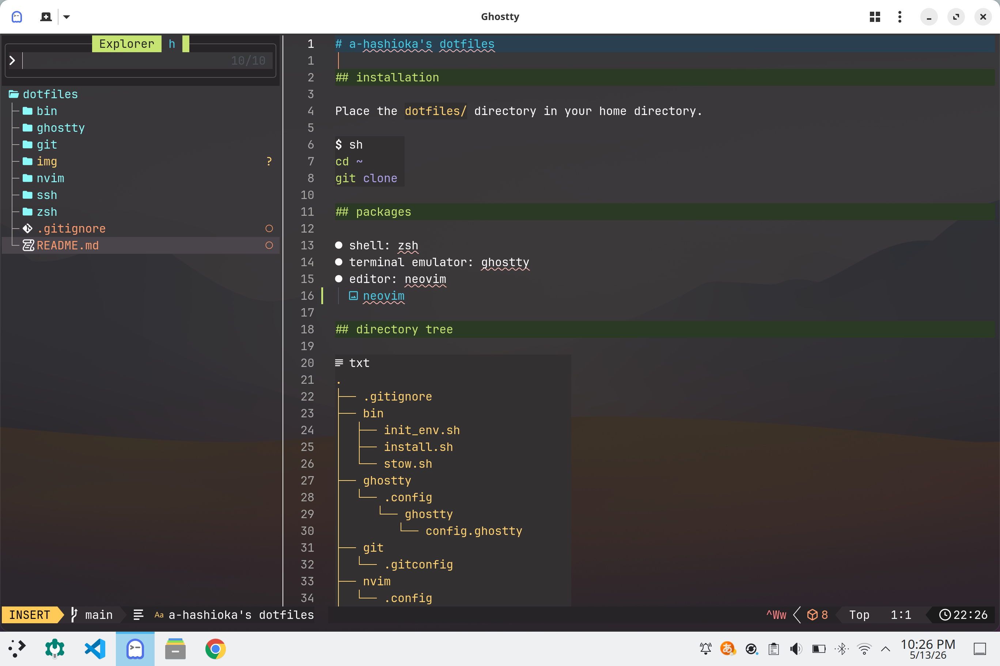

# a-hashioka's dotfiles

## installation

Place the `dotfiles/` directory in your home directory.

```sh
cd ~
git clone
```

## packages

- shell: zsh
- terminal emulator: ghostty
- editor: neovim
  

## directory tree

```txt
.
├── .gitignore
├── bin
│  ├── init_env.sh
│  ├── install.sh
│  └── stow.sh
├── ghostty
│  └── .config
│     └── ghostty
│        └── config.ghostty
├── git
│  └── .gitconfig
├── nvim
│  └── .config
│     └── nvim
│        ├── .neoconf.json
│        ├── init.lua
│        ├── lazy-lock.json
│        ├── lua
│        │  ├── config
│        │  │  ├── autocmds.lua
│        │  │  ├── keymaps.lua
│        │  │  ├── lazy.lua
│        │  │  └── options.lua
│        │  └── plugins
│        │     ├── colortheme.lua
│        │     ├── dashboard.lua
│        │     └── example.lua
│        └── stylua.toml
├── README.md
├── ssh
│  └── .ssh
│     └── config
└── zsh
   ├── .zsh
   │  ├── .fzf.zsh
   │  ├── .p10k.zsh
   │  ├── alias.zsh
   │  ├── completion.zsh
   │  ├── history.zsh
   │  ├── path.zsh
   │  └── plugin.zsh
   └── .zshrc
```
